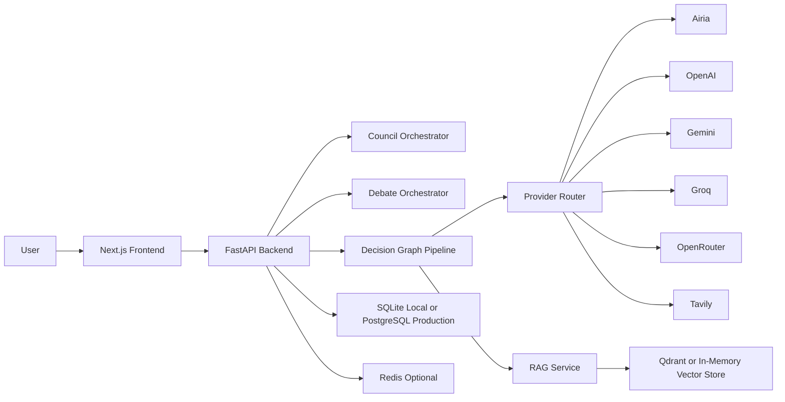
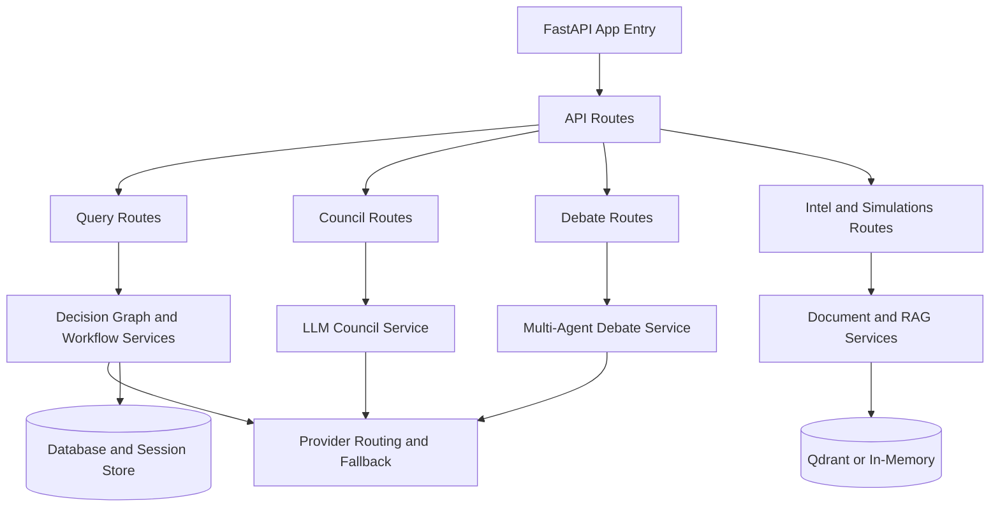
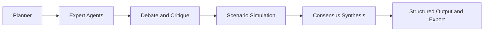
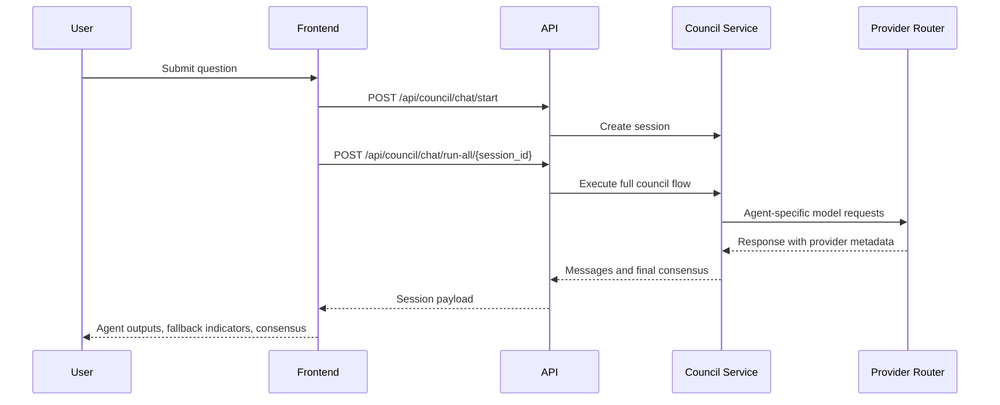
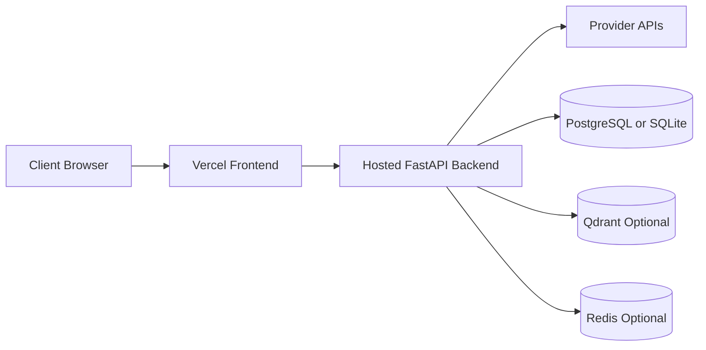

# OmniMind AI

OmniMind AI is a multi-agent decision intelligence platform that combines structured reasoning, retrieval-augmented knowledge, simulations, and consensus generation.

It supports two orchestration modes:

- Council mode: seven coordinated specialist agents
- Debate mode: four persona-driven agents with explicit argumentation

## Table of Contents

- Architecture at a glance
- How the system works
- Repository layout
- Local development setup
- Runtime endpoints
- API map
- Environment variables
- Deployment model
- Troubleshooting

## Architecture at a Glance

### System Context



### Backend Component View



### Decision Pipeline



### Request Sequence (Council Run-All)



## How the System Works

### Council Mode

Council mode runs seven specialist agents with role-specific prompts and provider routing.

| Agent | Role | Typical Provider |
|---|---|---|
| Analyst | Logical decomposition and framing | OpenAI |
| Researcher | Evidence synthesis | OpenAI and Tavily |
| Critic | Challenge and risk pressure testing | Gemini |
| Strategist | Strategic planning | Gemini |
| Debater | Counter-position generation | Groq |
| Synthesizer | Pattern merge and recommendation shaping | Groq |
| Verifier | Final coherence and consistency checks | Airia-first fallback model |

### Debate Mode

Debate mode runs persona-driven reasoning for focused argumentation.

| Persona | Role | Typical Provider |
|---|---|---|
| Priya | Research intelligence | Tavily and OpenAI |
| Arjun | Risk analysis | OpenRouter |
| Kavya | Financial strategy | OpenAI |
| Ravi | Execution strategy | Gemini |

### Routing and Fallback Policy

- Airia-first fallback is attempted when a requested provider fails.
- Silent cross-provider drift is blocked.
- Fallback metadata is propagated to responses.
- Frontend surfaces requested and used provider information.

Fallback marker format:

```text
[FALLBACK requested=<provider> used=<provider|none> reason=<reason_code>]
```

### Persona Output Validation

Persona outputs are validated against required structures. Validation errors are surfaced instead of silently passing malformed output.

Validation marker format:

```text
[VALIDATION_FAILED persona=<name> missing=<fields>]
```

## Repository Layout

```text
OmniMind-AI/
├── backend/
│   ├── main.py
│   ├── api/routes/
│   ├── app/api/routes/
│   ├── services/
│   ├── app/services/
│   ├── core/
│   └── models/
├── frontend/
│   ├── src/app/
│   ├── src/components/
│   ├── src/lib/
│   └── src/types/
├── docs/
├── docker-compose.yml
├── vercel.json
└── README.md
```

Compatibility shims exist under backend/app/api/routes so route imports remain stable while backend reorganization continues.

## Local Development Setup

### Prerequisites

- Node.js 18 or newer
- npm 8 or newer
- Python 3.13 or compatible interpreter used by your virtual environment

### Start Everything

Linux and macOS:

```bash
./start-full-system.sh
```

Windows:

```bat
start-full-system.bat
```

### Start Services Separately

Backend only:

```bash
./start-backend.sh
```

Frontend only:

```bash
./start-frontend.sh
```

### Manual Frontend Commands

```bash
cd frontend
npm install
npm run dev
```

### Manual Backend Commands

```bash
cd backend
pip install -r requirements.txt
uvicorn main:app --reload --host 0.0.0.0 --port 8000
```

## Runtime Endpoints

| URL | Purpose |
|---|---|
| http://localhost:3000 | Frontend UI |
| http://localhost:8000 | Backend API root |
| http://localhost:8000/docs | OpenAPI and Swagger UI |
| http://localhost:8000/health | Global health status |
| http://localhost:8000/api/council/health | Council routing and provider health |
| http://localhost:8000/api/integrations/status | Integration status |

## API Map

### Core Workflow

| Method | Path | Purpose |
|---|---|---|
| POST | /api/queries | Start full decision workflow |
| GET | /api/queries/{id} | Get workflow state |
| WS | /api/queries/{id}/stream | Stream workflow events |
| GET | /api/queries/{id}/export?format=json\|pdf | Export workflow artifact |
| POST | /api/simulations | Run scenario simulation |

### Human-in-the-Loop

| Method | Path | Purpose |
|---|---|---|
| POST | /api/queries/{id}/hitl/decision | Approve or reject a gate |
| GET | /api/queries/{id}/hitl | List recorded gate decisions |

### Integrations

| Method | Path | Purpose |
|---|---|---|
| GET | /api/integrations/status | Integration connectivity |
| POST | /api/queries/{id}/integrations/execute | Execute integration actions |
| GET | /api/queries/{id}/integrations | Integration history |

### Council

| Method | Path | Purpose |
|---|---|---|
| GET | /api/council/health | Provider and routing health |
| GET | /api/council/agents | Agent registry |
| POST | /api/council/chat/start | Create council session |
| POST | /api/council/chat/run-all/{session_id} | Execute full council run |

### Debate

| Method | Path | Purpose |
|---|---|---|
| POST | /api/debate/run | Execute debate flow |

## Environment Variables

### Core

| Variable | Purpose |
|---|---|
| DATABASE_URL | SQL persistence layer |
| REDIS_URL | Optional cache and memory services |
| QDRANT_URL | Optional vector store |

### Airia and Legacy Gradient Aliases

| Variable | Purpose |
|---|---|
| AIRIA_API_KEY | Airia authentication |
| AIRIA_API_URL | Airia endpoint base URL |
| AIRIA_AGENT_ID | Optional Airia agent route |
| GRADIENT_API_KEY | Legacy alias of AIRIA_API_KEY |
| GRADIENT_BASE_URL | Legacy alias of AIRIA_API_URL |
| GRADIENT_WORKSPACE_ID | Legacy alias of AIRIA_AGENT_ID |

### Additional Provider Keys

| Variable | Purpose |
|---|---|
| OPENAI_API_KEY | Council OpenAI agents |
| OPENAI_RESEARCH_API_KEY | Priya research analysis |
| OPENAI_FINANCE_API_KEY | Kavya financial analysis |
| GOOGLE_API_KEY | Council Gemini agents |
| GEMINI_API_KEY | Ravi strategy analysis |
| GROQ_API_KEY | Council Groq agents |
| OPENROUTER_API_KEY | Arjun risk analysis |
| TAVILY_API_KEY | Live web retrieval |

## Deployment Model

### Target Topology



### Vercel Notes

- The project includes a resilient vercel.json command strategy that works from either repository root or frontend root.
- Frontend expects NEXT_PUBLIC_API_URL to point to the deployed backend.
- Backend CORS should include your Vercel production and preview domains.

## Troubleshooting

### Vercel build fails with no such file or directory for frontend

Cause:

- Build command assumes a frontend subdirectory while Vercel root is already frontend.

Fix:

- Use the included vercel.json, which conditionally changes directory only when frontend exists.

### Frontend cannot reach backend

Checklist:

- Verify NEXT_PUBLIC_API_URL points to the backend base URL.
- Verify backend CORS allows your frontend domain.
- Verify backend health endpoint is reachable from the public internet.

### Provider responses are inconsistent

Checklist:

- Confirm provider API keys are configured.
- Confirm fallback markers appear in payload when fallback happens.
- Use council health and integration status endpoints for diagnostics.

## License

MIT
